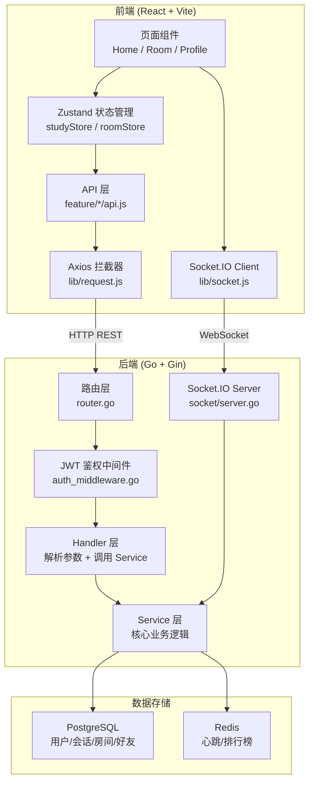
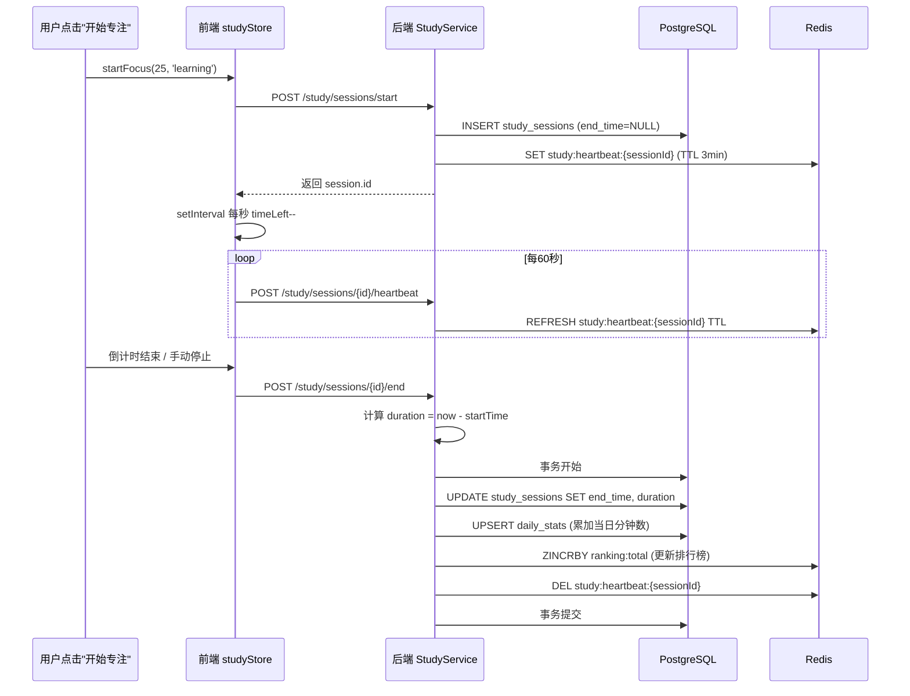
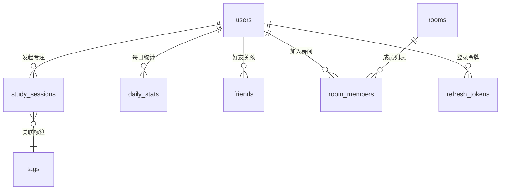

# GroupLeveling 全栈代码走读 · 答辩防翻车手册

> **目标**：让你在导师面前，能够从任意一个功能入口出发，讲清楚 **"数据从前端按钮 → HTTP/WebSocket → 后端处理 → 数据库 → 返回前端渲染"** 的完整链路。

---

## 一、项目整体架构（先画大图）



> [!TIP]
> **讲的时候**：先画这张图，告诉导师"我的系统分三层，前端用 React，后端用 Go，存储用 PostgreSQL + Redis"，然后再逐个模块深入。

---

## 二、后端分层架构（你必须讲清楚的）

后端采用经典的 **Router → Middleware → Handler → Service → Database** 五层架构：

| 层级 | 文件位置 | 职责 | 关键设计 |
|------|---------|------|---------|
| **路由层** | [router.go](file:///home/edward/coding/groupLeveling/backend/internal/router/router.go) | URL 映射到处理函数 | 按业务分组：`/users`、`/study`、`/rooms`、`/friends` |
| **中间件** | [auth_middleware.go](file:///home/edward/coding/groupLeveling/backend/internal/middleware/auth_middleware.go) | JWT 鉴权，提取 `userId` | 解析 `Authorization: Bearer <token>` 并 `c.Set("userId", ...)` |
| **Handler** | `handler/*.go` | 参数校验 + 调用 Service + 返回 JSON | 只做"翻译"工作，不包含业务逻辑 |
| **Service** | `service/*.go` | **核心业务逻辑**、数据库操作、Redis 交互 | 事务处理、Upsert、算法计算 |
| **Model** | [schema.go](file:///home/edward/coding/groupLeveling/backend/internal/model/schema.go) | GORM 数据模型定义 | 定义表结构、关联关系、索引 |

> [!IMPORTANT]
> **导师可能问**："为什么 Handler 和 Service 要分开？"
> **你的回答**："Handler 只负责 HTTP 协议层的事情（解析参数、返回 JSON），Service 负责业务逻辑。这样 Service 可以被 HTTP Handler 和 WebSocket 事件处理器**共同复用**。比如 `roomService.JoinRoom()` 既被 HTTP 接口调用，也被 Socket.IO 的 `join_room` 事件调用。"

---

## 三、核心模块逐个击破

### 模块 1：认证系统（Auth）

**完整链路**：注册/登录 → 生成双 Token → 前端存储 → 后续请求自动携带

#### 后端设计要点
- **双 Token 机制**：AccessToken（15分钟短有效期）+ RefreshToken（7天长有效期）
- **RefreshToken 轮换**：每次刷新都废弃旧 Token、生成新 Token，防止令牌复用攻击
- **密码安全**：使用 `bcrypt` 加盐哈希，数据库不存明文密码
- **RefreshToken 存储**：数据库只存 Token 的 SHA256 哈希值，即使数据库泄露也无法伪造

```
用户登录 → AuthService.Login()
  ├── 1. 查找用户 (database.DB.Where email)
  ├── 2. bcrypt 校验密码
  ├── 3. 生成 AccessToken (JWT, 15min)
  ├── 4. 生成 RefreshToken (JWT, 7天)
  └── 5. 存 RefreshToken 哈希到 refresh_tokens 表
```

#### 前端设计要点
- [request.js](file:///home/edward/coding/groupLeveling/frontend-react/src/lib/request.js)：Axios 拦截器自动在每个请求头加 `Bearer Token`
- 401 响应自动清除 Token 并跳转登录页

> [!TIP]
> **导师可能问**："为什么用双 Token？"
> **你的回答**："AccessToken 短期有效减少被盗窗口，RefreshToken 长期有效维持登录态。RefreshToken 用一次就废弃（轮换机制），即使被截获，攻击者和合法用户谁先用谁有效，另一个会触发'令牌复用检测'。这是 OAuth 2.0 的最佳实践。"

---

### 模块 2：番茄钟 & 专注系统（Study）⭐ 最核心

**这是整个系统最复杂的模块，涉及前后端协同、定时器、心跳、僵尸会话清理。**

#### 数据流完整链路



#### 三个关键设计你必须能讲清楚

**1. 心跳机制 (Heartbeat)**
- 代码位置：[study_service.go L111-131](file:///home/edward/coding/groupLeveling/backend/internal/service/study_service.go#L111-L131)
- **为什么需要**：用户可能关闭浏览器、断网、电脑崩溃，此时 end_time 永远不会被设置，产生"僵尸会话"
- **怎么做的**：前端每 60 秒发一次心跳，后端往 Redis 写一个 TTL 为 3 分钟的 Key。如果 3 分钟内没收到心跳，Key 自动过期

**2. 僵尸会话清理器 (Session Reaper)**
- 代码位置：[study_reaper.go](file:///home/edward/coding/groupLeveling/backend/internal/service/study_reaper.go)
- **怎么做的**：后台协程每 5 分钟扫描所有 `end_time IS NULL` 的会话，检查 Redis 心跳 Key 是否还在。如果 Key 已过期，说明用户已离线，自动结束会话并补算时长
- **事务保证**：清理时在同一个数据库事务里更新 session + daily_stats，保证数据一致性

**3. DailyStat Upsert（日统计表的幂等写入）**
- 代码位置：[study_service.go L20-40](file:///home/edward/coding/groupLeveling/backend/internal/service/study_service.go#L20-L40)
- **怎么做的**：使用 PostgreSQL 的 `INSERT ... ON CONFLICT DO UPDATE`，如果当天已有记录就累加分钟数，没有就插入新记录
- **为什么这样设计**：活动热力图需要"每天一条"的聚合数据，如果每次都 SUM 全表 study_sessions 性能太差，所以用预计算的 daily_stats 表

#### 前端状态管理

[studyStore.js](file:///home/edward/coding/groupLeveling/frontend-react/src/store/studyStore.js) 使用 Zustand + persist 中间件：
- **状态机**：`idle → focusing → (倒计时结束) → resting → idle`
- **持久化**：`sessionId`、`status`、`startTime` 等关键状态存入 localStorage，刷新页面后通过 `checkActiveSession()` 从后端恢复
- **自动切换**：专注结束后自动启动休息计时器（`handleTimerComplete`）

---

### 模块 3：自习室 & WebSocket 实时通信（Room）

#### 架构要点

```
前端                              后端
┌─────────────────┐         ┌──────────────────────┐
│ RoomConnectionManager │◄──►│ socket/server.go      │
│ (无UI的管理组件)    │    │ (Socket.IO Server)    │
│                     │    │                      │
│ roomStore (Zustand) │    │ roomService (业务)    │
│ - members[]         │    │ - JoinRoom()          │
│ - messages[]        │    │ - LeaveRoom()         │
│ - socketStatus      │    │ - UpdateStatus()      │
└─────────────────┘         └──────────────────────┘
```

#### 六个 Socket 事件

| 事件名 | 方向 | 作用 |
|--------|------|------|
| `join_room` | 客户端→服务端 | 加入房间（校验密码、人数限制）|
| `leave_room` | 客户端→服务端 | 离开房间 |
| `send_message` | 客户端→服务端 | 发送聊天消息 |
| `update_status` | 客户端→服务端 | 同步学习状态（idle/learning/rest）|
| `send_private_message` | 客户端→服务端 | 私聊消息（持久化到 DB）|
| `invite_to_room` | 客户端→服务端 | 邀请好友（生成通知 + Socket 推送）|

#### 你必须能讲清楚的设计

**1. RoomConnectionManager 是个"无 UI 组件"**
- 代码位置：[RoomConnectionManager.jsx](file:///home/edward/coding/groupLeveling/frontend-react/src/components/room/RoomConnectionManager.jsx)
- 它 `return null`，不渲染任何东西，但挂在 AppLayout 里全局存在
- 职责：监听 `activeRoomId` 变化，自动 join/leave 房间、绑定/解绑事件监听器
- **为什么这样设计**：把 Socket 连接管理从页面组件中抽离出来，这样用户离开房间页面（比如回到首页），Socket 连接仍然保持，房间消息仍然可以收到（体现为导航栏的未读消息计数）

**2. 断线自动清理**
- 代码位置：[server.go L274-302](file:///home/edward/coding/groupLeveling/backend/internal/socket/server.go#L274-L302)
- Socket 断开时，自动调用 `roomService.LeaveRoom()` 清理数据库中的成员记录，并广播 `user_left` 给房间内其他人

**3. 学习状态实时同步**
- 前端 studyStore 的 status 变化时，自动通过 Socket 发送 `update_status` → 后端更新 room_members 表 → 广播给房间内所有人
- 这样房间内的其他人可以实时看到"谁在学习、谁在休息、谁在摸鱼"

---

### 模块 4：同频学伴推荐算法（Matching）⭐ 亮点

- 代码位置：[matching_service.go](file:///home/edward/coding/groupLeveling/backend/internal/service/matching_service.go)

#### 算法原理（必须能讲）

**特征提取**：从用户近 30 天的 `study_sessions` 表中提取 6 维向量：

```
V(user) = [早晨占比, 下午占比, 晚上占比, 深夜占比, 归一化均次时长, 归一化日均时长]
```

| 维度 | 计算方式 | 含义 |
|------|---------|------|
| MorningRatio | 06-12点总时长 / 总时长 | 早起鸟偏好 |
| AfternoonRatio | 12-18点总时长 / 总时长 | 下午茶偏好 |
| EveningRatio | 18-24点总时长 / 总时长 | 晚高峰偏好 |
| NightRatio | 0-6点总时长 / 总时长 | 夜猫子偏好 |
| NormalizedAvgDur | min(均次时长/120, 1.0) | 专注节奏 |
| NormalizedDailyMin | min(日均时长/480, 1.0) | 学习强度 |

**相似度计算**：余弦相似度

$$\text{similarity} = \frac{\vec{V_1} \cdot \vec{V_2}}{|\vec{V_1}| \times |\vec{V_2}|}$$

**冷启动策略**：如果用户没有历史数据（TotalMins == 0），直接推荐最近3天的活跃用户

> [!TIP]
> **导师可能问**："为什么用余弦相似度而不是欧几里得距离？"
> **你的回答**："余弦相似度衡量的是方向相似性，不受绝对值影响。比如一个每天学4小时的人和每天学8小时的人，如果他们的时段分布一样（都是晚上学），余弦相似度会很高。而欧几里得距离会因为绝对时长差异而判定他们不相似。我们关注的是'习惯模式'而不是'学习总量'。"

---

### 模块 5：等级系统（Gamification）

- 代码位置：[level_service.go](file:///home/edward/coding/groupLeveling/backend/internal/service/level_service.go)

#### 等级公式

| 等级区间 | 公式 | 设计意图 |
|---------|------|---------|
| 1-80级 | `分钟数 = 9.375 × L²` | 二次函数，前期升级快，后期越来越慢 |
| 80-100级 | `分钟数 = 60000 + 27000 × (L-80)` | 线性函数，每级固定需要 450 小时 |

> 1级只需要约10分钟，10级需要约15.6小时，50级需要约390小时，80级需要1000小时

---

### 模块 6：数据可视化（Analytics）

- 代码位置：[analytics_service.go](file:///home/edward/coding/groupLeveling/backend/internal/service/analytics_service.go)

**活动热力图**：直接查询预计算的 `daily_stats` 表，返回 `{date, count}` 数组

**时间矩阵**（7×24 网格）：
- 遍历所有 study_sessions
- 对于每个 session，按小时边界切割，精确分配到对应的 `[星期几][小时]` 格子里
- 这个切割算法是关键：一个从 23:30 到 01:15 的 session，会被拆成 23点30分钟 + 0点60分钟 + 1点15分钟

---

### 模块 7：好友系统（Friend）

- 代码位置：[friend_service.go](file:///home/edward/coding/groupLeveling/backend/internal/service/friend_service.go)

**双向自动接受**：
```
A 发请求给 B → 创建记录 (A→B, pending)
B 发请求给 A → 检测到反向 pending → 自动将 A→B 改为 accepted
```
只需要一条数据库记录就表示了双向好友关系。

---

## 四、前端架构要点

### 状态管理策略

| Store | 持久化 | 管理什么 |
|-------|--------|---------|
| [studyStore](file:///home/edward/coding/groupLeveling/frontend-react/src/store/studyStore.js) | ✅ localStorage | 番茄钟状态、sessionId、计时器 |
| [roomStore](file:///home/edward/coding/groupLeveling/frontend-react/src/store/roomStore.js) | ❌ | 当前房间、成员列表、聊天消息 |

> **为什么 studyStore 要持久化？** 用户刷新页面后，计时器不能丢。通过 localStorage 保存 sessionId 和 startTime，刷新后调用 `checkActiveSession()` 从后端恢复剩余时间。

### 请求层设计

```
页面组件 → feature/*/api.js → lib/request.js (Axios) → 后端
                                    ↑
                              自动加 Bearer Token
                              自动处理 401 跳登录
                              自动 toast 错误提示
```

---

## 五、数据库关键表关系



---

## 六、Docker 部署架构

```yaml
services:
  frontend:  # React + Vite 开发服务器 (端口 5173)
  app:       # Go + Gin 后端 (端口 8080)
  db:        # PostgreSQL 15 (端口 5432)
  redis:     # Redis 7 (端口 6379)
```

前端通过 Vite 的 proxy 配置将 `/api/*` 代理到后端 `http://app:8080`。

---

## 七、答辩常见问题速查

| 问题 | 回答要点 |
|------|---------|
| 为什么选 Go？ | 编译型语言，高并发 goroutine 天然支持 WebSocket，部署只需要一个二进制文件 |
| 为什么选 React 不选 Vue？ | React 的 Hooks + Zustand 状态管理更灵活，组件组合模式更适合复杂 UI |
| 为什么用 Redis？ | 两个用途：(1) 心跳检测用 TTL Key 实现自动过期 (2) 排行榜用 Sorted Set O(logN) 排序 |
| 为什么用 Socket.IO 不用原生 WebSocket？ | Socket.IO 自带房间(Room)概念、自动重连、事件命名空间，省去大量基础设施代码 |
| 前后端怎么交互的？ | HTTP REST API 做 CRUD，Socket.IO 做实时通信（聊天、状态同步） |
| 数据一致性怎么保证的？ | 后端用 GORM 事务（`database.DB.Transaction`），比如结束会话时在一个事务里同时更新 session + daily_stats |
| 怎么防止作弊？ | (1) 时长由后端计算（`now - startTime`），不信任前端传值 (2) 心跳机制确保用户在线 (3) 僵尸清理器兜底 |
