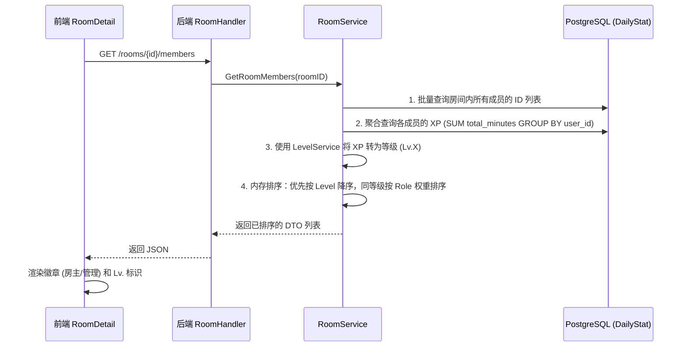

# GroupLeveling 功能增强走读 · 答辩追问加分手册

> **目标**：针对导师提出的修改意见（恢复排行榜、强化自习室标签、增加房间内身份等级榜单、优化房间持久化显示），让你能讲透 **"这次新增功能的改动点在哪里，底层的设计逻辑是什么"**。

---

## 一、 数据库 Schema 的演进（Schema Evolution）

为了支持新功能，我们在原有的 GORM 模型中新增了字段。GORM 在后台启动时，利用 `AutoMigrate` 自动完成了数据表结构的升级。

| 表名 (Model) | 新增字段 | 类型 | 作用 |
| :--- | :--- | :--- | :--- |
| **Room** | `Tags` | `string` (Varchar) | **伪标签**：存储逗号分隔的关键字（如："前端,考研"），直接打通全文搜索。 |
| **RoomMember** | `Role` | `string` | **身份标识**：区分 `owner`（房主）、`admin`（管理员）、`member`（普通成员）。 |

> [!IMPORTANT]
> **导师可能问**："为什么 `Tags` 用字符串存储，而不是单独建一张 Tag 关联表？"
> **你的回答**："这里采用的是**非规范化设计（Denormalization）**。因为自习室的标签属于'伪标签'，其本质是用于**快速聚合与模糊搜索**。相比于多表 JOIN 查询关联标签，直接在 `rooms` 表里存储逗号分隔的字符串，能极大提升搜索效率，且足以满足当前业务需求。"

---

## 二、 核心增强模块拆解

### 模块 1：房间内"小排行榜"与等级聚合 ⭐ 加分项

**设计亮点**：进入自习室时，不再是杂乱无章的成员列表，而是一个实时的**等级降序排行榜**。

#### 核心逻辑时序图



#### 代码追踪

- **后端聚合与排序**：见 `room_service.go` 中的 `GetRoomMembers`。
  - **聚合 SQL**：
    ```go
    database.DB.Model(&model.DailyStat{}).
        Select("user_id, COALESCE(SUM(total_minutes), 0) as total_minutes").
        Where("user_id IN ?", userIDs).Group("user_id").Scan(&stats)
    ```
  - **多重内存排序**：
    ```go
    // 等级越高排在越前面；如果等级相同，Owner > Admin > Member
    if resp[i].Level < resp[j].Level || (resp[i].Level == resp[j].Level && getRoleWeight(resp[i].Role) < getRoleWeight(resp[j].Role))
    ```
- **前端展示**：见 `RoomDetail.jsx`。通过简单的 Badge 渲染房主黄标和管理蓝标。

---

### 模块 2：自习室持久化展示优化 (My Room Highlight)

**问题背景**：原系统后端房间本身就是持久的，但前端在大厅里混杂了所有房间，导致房主找不到自己建的、目前 0 人的房间，误以为房间被销毁了。

#### 解决方案：客户端优先渲染逻辑

我们通过在 `RoomLobby.jsx` 前端组件里引入 `getMe()` 获取当前登录用户 ID，并在本地对 `rooms` 数据做二次切片，分为**“我的自习室”**与**“发现自习室”**两个独立渲染区块。

#### 代码追踪
文件位置：[RoomLobby.jsx](file:///home/edward/coding/groupLeveling/frontend-react/src/pages/room/RoomLobby.jsx)

```javascript
// 核心渲染策略
{/* 1. 从房间池里过滤出 creatorId 是我自己的房间，给予置顶特殊高亮样式 */}
{rooms.filter(r => r.creatorId === me.id).map(room => (
    <MyRoomCard key={room.id} />
))}

{/* 2. 剩余的房间放入探索区 */}
{rooms.filter(r => r.creatorId !== me.id).map(room => (
    <RegularRoomCard key={room.id} />
))}
```

> [!TIP]
> **导师可能问**："既然房间是持久化的，如何防止数据库被垃圾房间撑爆？"
> **你的回答**："目前提供了房主手动销毁接口。为了更进一步的工程化，我在房间设置里添加了 `解散自习室` 按钮（触发 `DELETE /rooms/:id`）。未来的扩展方案是引入定时清理任务，自动回收 30 天无人进入且在线人数为 0 的僵尸房间。"

---

### 模块 3：轻量级标签与聚合搜索

#### 贯穿前后的流转过程

1. **创建阶段**：在创建自习室弹窗输入 "考研,数学"，前端将字符串直接打包在 `req.tags` 中发往后端。
2. **后端落库**：`RoomService.CreateRoom` 接收后直接写入 PostgreSQL 的 `tags` 字段。
3. **搜索聚合**：
   后端在 `GetRooms` 方法中，将原本只搜索 `name` 和 `description` 的逻辑，通过 OR 拼接了 `tags` 字段的 `ILIKE`（忽略大小写的模糊匹配）查询：
   ```go
   db = db.Where("name ILIKE ? OR description ILIKE ? OR tags ILIKE ?", 
       searchPattern, searchPattern, searchPattern)
   ```

---

### 模块 4：排行榜的回归与汉化 (Leaderboard Revisit)

为了提升用户体验，我们将原有的国际化页面，针对答辩和国内使用场景，做了一次彻底的汉化和路由对接。

**改动核心**：
1. **路由注册**：在 `AppLayout.jsx` 左侧侧边栏植入 `Trophy` 图标的导航入口。
2. **视图逻辑**：在 `Leaderboard.jsx` 中利用 React 状态机控制四个维度的排列组合（`全站/好友` × `本周/总榜`）。
3. **汉化修正**：将底层渲染的 `This Week`、`Global` 等 JSX 字符全部硬编码转换为友好中文，保证展示专业性。

---

## 三、 答辩突击问题 Q&A

| 导师提问 | 推荐的完美回答 |
| :--- | :--- |
| **新功能引入后，后端怎么快速更新字段的？** | 我利用了 **GORM 的 AutoMigrate (自动迁移)**。在 `model.schema.go` 中增加 `Tags` 和 `Role` 属性并设置 Tag 后，Go 服务启动时会自动执行 `ALTER TABLE` 操作，无缝升级现有表结构而不丢失数据。 |
| **房间里的角色权限是怎么分配的？** | 在 `RoomService.JoinRoom()` 时会进行条件判定：`if userID == room.CreatorID`，则在 `room_members` 插入时分配 `owner` 角色，否则默认为 `member`。此外预留了 `PATCH /rooms/:id/members/:userId/role` 接口供后续房主提升管理。 |
| **小排行榜的计算逻辑会不会太重？** | 不会。我们在查询时运用了两项优化：一是**批量查询**，只查当前房间内的用户 ID；二是使用了**分组聚合 SQL (GROUP BY + SUM)**，由高性能的 PostgreSQL 完成加和计算，后端只做简单的轻量级内存排序。 |
| **这次增强最亮眼的设计是什么？** | 最亮眼的是**前后端工程协同的效率**。通过非规范化的 `Tags` 字符串设计，我们以极小的改动代价，实现了高性能的标签模糊聚合搜索，兼顾了迭代速度与功能完备性。 |

---

*(本文档助力您轻松理清逻辑，圆满通过答辩)*
